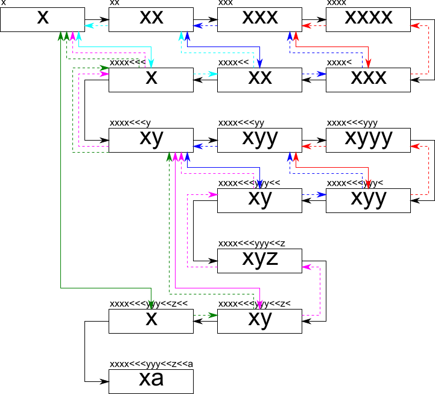

Typewrite is a library to animate behavior of a type writer.

Library parses formatted string and generate chains of string according to the frame. Value of the string can be obtained for any given frame value.

Main feautures
--------------

* uses 'frame' and 'step' units - step should be associated with one second,
* provides macros for processing large portions of text in terms of characters, words and lines
* by defualt there is 25 frames per step (second),

Usage
=====

TypeWriter uses control sequences and macros to render sequence of rendered strings. Some of the control sequences and macros can be modified by additinal option parameters:

Options
-------
Options must be enclosed in [] brackets and follow directly control sequence or macro. Currently there are following options supported:

* *n* --- number, its usage may vary between various control sequences and commands
* *n*f --- number of frames,
* *n*s --- number of steps,

Control sequences
-----------------
In below, each presence of [...] denotes which options are accepted and are optional (non-accepted options are ignored). Non of the sequences have mandatory options.

* ',[*n*,*n*f,*n*s]' -- next frame(s), available options *n*, *n*f (skip *n* frames), *n*s (skip *n* steps, equivalent of *n*\*fps frames), frames and steps are additive,
* '>[*n*,*n*s]' -- next step(s), available options *n*, *n*s (skip *n* steps, equivalent of *n*\*fps frames), steps *n*s if passed are ignored, *n* and *n*s are additive,
* '<[*n*]*text*' -- delete string from the last frame (multiple '<' delete more frames), available options: *n* - delete n-last non-empty frames, can be followed by a text but any text before '<' will be ignored,
* '\' -- escapes any follwoing character from being interpreted as control sequence or macro, for '\n' and '\t' inserts newline or tabular.

Macros
------

Each macro starts with : followed by the letter containing operation, next options [] can be passed and macro must contain pair of {} brackets with the macro content inside.

* :c[*n*,*n*f,*n*s]{*text*} -- split text into characters and insert every *n*+*n*s + *n*s*fps frames (if options are not given, default is 1 frame), preserves newline '\n' and tabulators '\t',
* :w[*n*,*n*f,*n*s]{*text*} -- split text into words, rest like for characters,
* :l[*n*,*n*f,*n*s]{*text*} -- split text into lines, rest like for characters,

Minimum example
---------------

```C++
TypeWriter tw;
tw.setFrameRate(2);
tw.setRawString("T>h>i>s>> is>[2] a>n>> e>x>m>a><<a>m>p>l>e");
tw.parse();
for (int i = 0; i < 20; ++i)
    printf("%s\n", tw.render(i).c_str());
```
will produce following chain of strings (numbers in brackets denote frame number):

    [ 0] T
    [ 1] Th
    [ 2] Thi
    [ 3] This
    [ 5] This is
    [ 7] This is a
    [ 8] This is an
    [10] This is an e
    [11] This is an ex
    [12] This is an exm
    [13] This is an exma
    [14] This is an exa
    [15] This is an exam
    [16] This is an examp
    [17] This is an exampl
    [18] This is an example

See also examples/demo.cpp

Demos and examples
-----

There are demo programs (they are not installable) which allows also to test your patterns or use default pattern (example above). To run default example execute (in your build directory)

`examples/tw_demo`

or

`eamples/tw_demo "my_custom_string"`

There are also files with examples, e.g.

* `examples/lorem_c.txt` - pattern to print text char by char
* `examples/lorem_w.txt` - pattern to print text word by word
* `examples/lorem_l.txt` - pattern to print text line by line

Use it following:

`examples/tw_demo -i examples/lorem_c.txt`

Additional switch `-f` allows to change frame rate, e.g.
`examples/tw_demo -f 50`

Installation
------------

```
git clone http://github.com/rlalik/TypeWriter.git
cd TypeWriter
mkdir build
cd build
cmake ..
make
```

C interface
-----------

There are wrapper function allowing to use Library with C code (e.g. MLT), here is set of wrapping function. See examples/demo.c for an example.
```C
typedef struct CTypeWriter TypeWriter;

extern void tw_init(struct CTypeWriter * tw);
extern void tw_finish(struct CTypeWriter * tw);
extern void tw_setFrameRate(struct CTypeWriter * tw, unsigned int fr);
extern unsigned int tw_getFrameRate(struct CTypeWriter * tw);
extern void tw_setRawString(struct CTypeWriter * tw, const char * str);
extern int tw_parse(struct CTypeWriter * tw);
extern void tw_render(struct CTypeWriter * tw, unsigned int frame, char * str, int length);
extern void tw_print(struct CTypeWriter * tw);
extern int tw_isEnd(struct CTypeWriter * tw);
```

Bypass mechanism
----------------

Bypass mechanics serves to properly traverse through the chain of strings in presence of delete char.

Picture below explains idea of bypass. The example is for pattern=`x,x,x,x,<,<,<,y,y,y,<,<,z,<,<,a`. For sake of readibility, comas were skipped in the picture below.

In the first four steps string of four *x* is created. In the next frame, a delete char *<* is present. Code goes to the previous frame, which is an initial string for current frame (full text) and then jumps to one frame back more, which is the expected frame. The bypass connection from this frame to current frame is established and the string is copied.

In the next frame, again the delete hcar *<* is present, therefore we jump to frame before, but this time it has bypass link, so we go along bypass and we jump to one frame before.

Tn general this is a recursive algorithm which can be described in five steps:

1. When the delete char *<* is present in current frame (n), jump to previous frame (j=n-1)
2. In a loop check if new (j) frame has a (b_j) bypass link and travel along it (j=b_j) until no more bypass links.
3. Jump to the frame before (j=j-1).
4. If the bypas link is present, jump recursively until no more bypass links (j=b_j)
5. Establish new bypas connection in current frame (b_n=j). Copy string from that frame (str_n=str_j).

Legend:

* `------->` frame steps
* `- - - ->` jumps
* `<------>` bypass link

